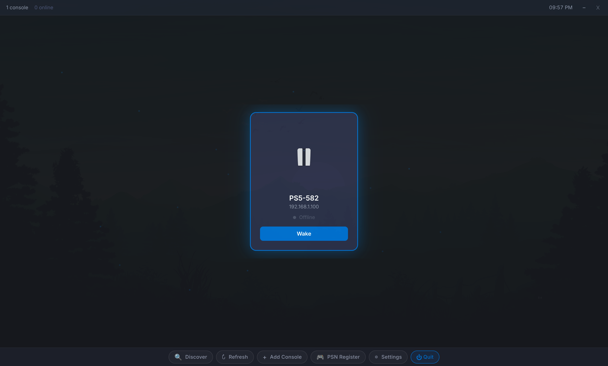

# Chiaki PS5

An Electron wrapper for [chiaki-ng](https://github.com/nowrep/chiaki-ng) with a PS5-inspired UI for discovering, waking, and streaming PS5 consoles on your local network.



## Features

- Auto-discover PS5 consoles on your network
- Wake consoles from standby with one click
- PSN account login and console registration
- DualSense haptic feedback support
- Configurable stream resolution (720p/1080p)
- Gamepad navigation (D-pad, Cross, Triangle, Options)
- Manual console management (add/remove by IP)

## Requirements

- Linux (Wayland or X11)
- [chiaki-ng](https://github.com/nowrep/chiaki-ng) installed (`chiaki` CLI in PATH)
- Node.js 18+ (for development)

## Install

### Arch Linux (pacman)

```bash
cd pkg/aur
makepkg -si
```

### AppImage / deb / rpm

```bash
npm install
npm run build
npx electron-builder --linux
# Output in dist/
```

### Development

```bash
npm install
npm run dev
```

## Usage

1. Launch **Chiaki PS5** from your application menu or run `chiaki-ps5`
2. Click **Discover** to find PS5 consoles on your network
3. Click **PSN Register** to sign in and register your console
4. Click a console card to select it, then **Wake** or **Connect**

## Build

```bash
npm run build    # Build renderer + main
npm run dev      # Development with hot reload
```

## License

MIT
